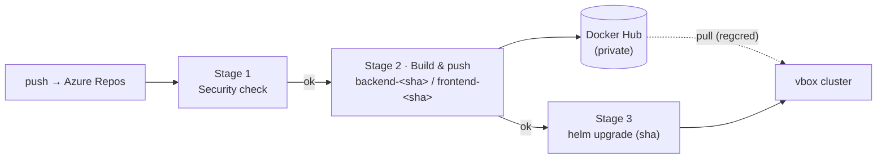
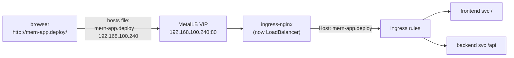

# MERN App — Full CI/CD on Azure DevOps to a VirtualBox Kubernetes Cluster

This repo ships a MERN app (React + Express + MongoDB) to a self-hosted
Kubernetes cluster running in VirtualBox. **One Azure DevOps pipeline does the
whole job** — security check, build & push images, then deploy — all on a
self-hosted agent that lives *inside* the cluster network.

- **CI/CD — Azure DevOps** (self-hosted agent on the cluster master), one
  pipeline, three gated stages:
  1. **Security check** — backend `npm audit`, frontend lint + build.
  2. **Build & push** — build backend + frontend images, push to a **private**
     Docker Hub repo tagged `backend-<sha>` / `frontend-<sha>`.
  3. **Deploy** — refresh the `regcred` image pull Secret, then `helm upgrade`
     with the exact `<sha>` just built. Runs only if the first two stages pass.
- **No secrets in git** — the Docker token is a secret variable in the ADO variable
  group (it also feeds the cluster's `regcred` pull Secret); app secrets live in
  a k8s Secret (see **Config & secrets** below).



**Why a self-hosted agent for everything?** The vbox cluster has no public
endpoint, so the deploy has to run from a machine inside the network. That same
agent (on the master) also has Docker, so it builds and pushes the images too —
no external CI system needs to reach the cluster, and no cluster credentials ever
leave the network.

> **GitHub Actions were removed.** Earlier this repo split CI (GitHub) from CD
> (Azure DevOps) and handed off via a REST call. That is gone — Azure DevOps now
> owns the full pipeline. GitHub (`github` remote) is optional, a plain mirror.

---

## How to read this doc

| Section | When you use it |
|---|---|
| [1. Cluster topology](#1-cluster-topology) · [2. Prerequisites](#2-prerequisites) | Reference — read once |
| [3. One-time bring-up](#3-one-time-bring-up-in-order) | Setting the system up, top to bottom |
| [4. Everyday workflow](#4-everyday-workflow-the-loop) | Every change, after bring-up |
| [5. Operate](#5-operate-verify-rollback-troubleshoot) | Health checks, rollback, debugging |
| [6. Hardening roadmap](#6-hardening-roadmap) · [7. File map](#7-file-map) | Reference |

The bring-up in §3 is **ordered and gated** — each step assumes the previous one
passed. Do not automate the pipeline (§3.5) before the manual deploy (§3.3) works.

---

## 1. Cluster topology

| Role | Host | IP |
|---|---|---|
| Master (+ Azure DevOps agent) | `sv-k8s-master` | 192.168.100.233 |
| Worker 1 | `sv-k8s-wk-1` | 192.168.100.231 |
| Worker 2 | `sv-k8s-wk-2` | 192.168.100.232 |

Conventions used throughout: namespace `mern-app`, Helm release `mern-app`,
ingress host `mern-app.deploy`, image repo `<DOCKERHUB_USERNAME>/web-app-mern`. The
ingress starts out exposed as a **NodePort** (bare-metal cluster, no cloud LB) —
that port is written as `<INGRESS_NODEPORT>` below (e.g. `30080`) and is reachable
on **any** node IP. §6.1 later upgrades it to a MetalLB **LoadBalancer** at
`192.168.100.240`, after which the port-free `http://mern-app.deploy/` is the
primary URL (the NodePort keeps working as a fallback).

---

## 2. Prerequisites

- [ ] kubeadm cluster up; `kubectl get nodes` shows all 3 `Ready`.
- [ ] On the master (the agent host): `helm` v3, `kubectl`, **and Docker** — the
      agent now builds images too, so a working Docker daemon is required.
- [ ] Azure DevOps org + project (free tier is fine) with this repo in Azure Repos.
- [ ] A **private** Docker Hub repo `web-app-mern` — create it on hub.docker.com
      *before* the first push (a push to a non-existent repo auto-creates it
      **public**) or flip it after: repo → Settings → Visibility → Private.
      The cluster pulls it via the `regcred` pull Secret (§3.1).
- [ ] A Docker Hub personal access token (Read & Write) for `DOCKERHUB_TOKEN` (§3.5).

---

## 3. One-time bring-up (in order)

### 3.1 Prepare the cluster

Run on the **master** (`192.168.100.233`).

**Ingress controller** (bare-metal → NodePort):
```bash
kubectl apply -f https://raw.githubusercontent.com/kubernetes/ingress-nginx/controller-v1.11.3/deploy/static/provider/baremetal/deploy.yaml
kubectl -n ingress-nginx get svc ingress-nginx-controller
# note the http NodePort, e.g. 80:3XXXX/TCP  → this is your <INGRESS_NODEPORT>
```

The NodePort above is **random** by default (K8s picks a free port in 30000–32767,
e.g. `32652`). This port belongs to the ingress controller, **not** to this app's
Helm chart — redeploying the app never changes it. To pin it to a fixed, memorable
value of your own so the app URL is stable, patch the controller Service:
```bash
kubectl -n ingress-nginx patch svc ingress-nginx-controller \
  -p '{"spec":{"ports":[{"name":"http","port":80,"nodePort":30080},{"name":"https","port":443,"nodePort":30443}]}}'
kubectl -n ingress-nginx get svc ingress-nginx-controller   # http now shows 80:30080/TCP
```
`<INGRESS_NODEPORT>` is then `30080`. Constraints: the value **must** be in
30000–32767 and unused — you can't use `80`/`8080` here without widening the
apiserver's `--service-node-port-range`. To drop the `:<port>` from the URL
entirely, install MetalLB instead (see [§6.1](#61-drop-the-port-with-metallb)).

**Namespace + app Secret** (holds `JWT_SECRET` and `MONGO_URI`):
```bash
kubectl create namespace mern-app
kubectl create secret generic mern-app-secrets -n mern-app \
  --from-literal=JWT_SECRET="$(openssl rand -hex 24)" \
  --from-literal=MONGO_URI='mongodb://mern-app-mongodb:27017/mern-app'
```

**Image pull Secret** — the Docker Hub repo is **private**, so the nodes need
credentials to pull it:
```bash
kubectl create secret docker-registry regcred -n mern-app \
  --docker-server=https://index.docker.io/v1/ \
  --docker-username=<DOCKERHUB_USERNAME> \
  --docker-password=<DOCKERHUB_TOKEN>
```
> This manual copy only has to be right for the manual deploy in §3.3 — once the
> pipeline is live (§3.5), its Deploy stage **recreates `regcred` on every run**
> from the variable group, so token rotations propagate automatically.

**Hosts entry** on your **Windows host** (`C:\Windows\System32\drivers\etc\hosts`,
as admin) so the browser resolves the app to a node:
```
192.168.100.231  mern-app.deploy
```
The app URL is then `http://mern-app.deploy:<INGRESS_NODEPORT>`.

> The master itself has **no** such entry — that's expected. When you `curl` the
> health endpoint from the master, use the Host-header form in §5.1, not the
> `mern-app.deploy` name.

### 3.2 Build + push images once, by hand

Prove the images build and push before wiring the pipeline. On the master (which
has Docker), with a Docker Hub login (`docker login`):

```bash
git clone https://lfglobaltech@dev.azure.com/lfglobaltech/DevOps/_git/MERN-simple-app
cd MERN-simple-app
SHA=$(git rev-parse HEAD)

docker build -t <DOCKERHUB_USERNAME>/web-app-mern:backend-$SHA  -f Dockerfile .
docker build -t <DOCKERHUB_USERNAME>/web-app-mern:frontend-$SHA -f client/Dockerfile client
docker push <DOCKERHUB_USERNAME>/web-app-mern:backend-$SHA
docker push <DOCKERHUB_USERNAME>/web-app-mern:frontend-$SHA
```

Confirm both tags appear on Docker Hub and the repo shows **Private** (pushing
to a private repo needs nothing extra — `docker login` covers it; only *pulls*
from the cluster need `regcred`). Note the `<sha>` — that's the tag you deploy
next. (This is exactly what the pipeline's **Build & push** stage automates
later.)

### 3.3 Manual Helm deploy — prove it by hand ⛔ (gate)

Before automating anything, deploy once by hand using the **same values file the
pipeline uses**, just rendered locally. On the master:

```bash
# render the tokenized values (exactly what the Deploy stage does)
sed -e "s|__crServer__|<DOCKERHUB_USERNAME>|g" \
    -e "s|__IMAGE_TAG__|<sha>|g" \
    -e "s|__ingressHost__|mern-app.deploy|g" \
    k8s-helm/mern-app/values.tokenized.yaml > /tmp/values.yaml

helm upgrade --install mern-app k8s-helm/mern-app \
  -n mern-app -f /tmp/values.yaml --wait --timeout 5m
```

Verify (see §5.1 for the health check), then open
`http://mern-app.deploy:<INGRESS_NODEPORT>` from your Windows host → register → login →
dashboard. That confirms the whole path: **frontend → ingress → backend → MongoDB.**

> **Gate:** do not wire up the pipeline (§3.4–3.5) until this manual deploy works.

### 3.4 Install the Azure DevOps self-hosted agent

The agent runs the **entire** pipeline on your network, so it needs
`docker` + `helm` + `kubectl` + a kubeconfig.

**In Azure DevOps:** Project settings → Agent pools → **Add pool** → Self-hosted →
name **`vbox-k8s`**. Create a PAT (User settings → PAT → scope **Agent Pools
(Read & manage)**).

**On the master** (`192.168.100.233`):
```bash
# docker (build stage) — install if not already present, and let the agent user
# run it without sudo:
#   sudo apt-get install -y docker.io && sudo usermod -aG docker "$USER"   # re-login after
docker version    # must succeed as the agent user, no sudo

# helm (kubectl already present from kubeadm)
curl -fsSL https://raw.githubusercontent.com/helm/helm/main/scripts/get-helm-3 | bash

# kubeconfig for the agent user (must work WITHOUT sudo)
mkdir -p ~/.kube && sudo cp /etc/kubernetes/admin.conf ~/.kube/config
sudo chown "$USER" ~/.kube/config
kubectl get nodes && helm version

# agent (grab the current download URL from the pool's "New agent → Linux" page)
mkdir ~/azagent && cd ~/azagent
curl -LO https://download.agent.dev.azure.com/agent/4.255.0/vsts-agent-linux-x64-4.255.0.tar.gz
tar zxvf vsts-agent-linux-x64-*.tar.gz
./config.sh   # Server: https://dev.azure.com/<org> · PAT · pool: vbox-k8s
sudo ./svc.sh install && sudo ./svc.sh start
```
Verify: Agent pools → `vbox-k8s` shows the agent **Online**.

> If Docker was installed *after* the agent service started, restart the agent
> (`sudo ./svc.sh stop && sudo ./svc.sh start`) so it picks up the new `docker`
> group membership — otherwise the build stage hits "permission denied" on the
> Docker socket.

### 3.5 Variable group + pipeline

**1. Variable group** — Pipelines → Library → + Variable group. Name: `mern-app-dev`.

Variables (🔒 off):

| Variable | Value |
|---|---|
| `CR_SERVER` | Docker Hub username, e.g. `thientr18` |
| `INGRESS_HOST` | `mern-app.deploy` |

Secrets (🔒 on):

| Variable | Value |
|---|---|
| `DOCKERHUB_TOKEN` | Docker Hub PAT (Read & Write) |

> `DOCKERHUB_TOKEN` is used twice: **Build & push** logs in to push the private
> repo, and **Deploy** recreates the `regcred` pull Secret from it so the
> cluster can pull. Rotate the PAT here and the next deploy updates the cluster.
>
> App secrets `JWT_SECRET` / `MONGO_URI` are not here — they live in the k8s Secret
> `mern-app-secrets` (§3.1).

**2. Pipeline** — Pipelines → New pipeline → Azure Repos Git → `MERN-simple-app`
→ branch `side-branch` → Existing YAML → `/azure-pipelines.yml`. Run once manually
to authorize the pool + variable group. Every push to `main` / `side-branch` then
runs it. **Bring-up complete.**

---

## 4. Everyday workflow (the loop)

Once §3 is done, every change is a **single push to Azure Repos**:

```powershell
git add -A && git commit -m "describe what changed"
git push origin side-branch           # Azure Repos → triggers the pipeline
```

What then happens automatically, all in Azure DevOps:
1. **Security check** — backend `npm audit`, frontend lint + build.
2. **Build & push** — `backend-<sha>` / `frontend-<sha>` to the private Docker Hub repo.
3. **Deploy** — refresh the `regcred` pull Secret, then `helm upgrade` to the
   exact `<sha>` image on the `vbox-k8s` agent.
4. **You verify** (§5.1).

That's the whole loop: **push → security → build → deploy the exact image.**

> **Mirroring to GitHub is optional now.** GitHub Actions were removed, so
> `git push github side-branch:main` only updates a mirror; it no longer runs any
> CI. Skip it unless you want the mirror.

---

## 5. Operate — verify, rollback, troubleshoot

### 5.1 Health check

Confirm pods and image tag, then hit the health endpoint ([app.js](app.js) →
`GET /api/v1/health`):

```bash
kubectl get pods -n mern-app -o wide     # backend, frontend, mongodb → Running 1/1
helm history mern-app -n mern-app        # latest revision = deployed

# From the MASTER (which has no mern-app.deploy hosts entry): send the Host header
# the ingress routes on, and target any node IP directly.
curl -H 'Host: mern-app.deploy' http://192.168.100.231:<INGRESS_NODEPORT>/api/v1/health
# → {"status":"UP","message":"Server is healthy"}

# after §6.1 (MetalLB): same check, port-free, via the VIP
curl -H 'Host: mern-app.deploy' http://192.168.100.240/api/v1/health
```

> **From your Windows host** (which *does* have the hosts entry from §3.1) just use
> the name directly: `curl http://mern-app.deploy:<INGRESS_NODEPORT>/api/v1/health`, or
> open it in the browser.

Why the Host header? The ingress routes by hostname. If you `curl mern-app.deploy` on a
machine with no hosts entry you get `curl: (6) Could not resolve host: mern-app.deploy`
— that's a DNS failure on *your* side, **not** an unhealthy app. `-H 'Host: ...'`
lets you target the node IP while still presenting the hostname ingress expects.

### 5.2 Rollback

```bash
helm history mern-app -n mern-app                     # pick the last good REVISION
helm rollback mern-app <REVISION> -n mern-app --wait
```
Or re-run the pipeline manually against an older commit (that image is still on
Docker Hub). Note: rolling back to the revision that is already `deployed` is a
no-op that just creates an identical new revision.

### 5.3 Troubleshooting

| Symptom | Fix |
|---|---|
| `curl: (6) Could not resolve host: mern-app.deploy` on the master | Expected — the master has no hosts entry. Use `curl -H 'Host: mern-app.deploy' http://192.168.100.231:<INGRESS_NODEPORT>/api/v1/health` (§5.1). **Not** an app failure. |
| Pipeline "waiting for agent" | agent offline (`sudo ./svc.sh status`) or pool name ≠ `vbox-k8s` |
| Build stage: `docker: command not found` (exit 127) | Docker not installed on the agent — `sudo apt-get install -y docker.io`, then **restart the agent** (§3.4) |
| Build stage: `permission denied … /var/run/docker.sock` | agent user not in the `docker` group, or agent started before Docker install — add the user and restart the agent (§3.4) |
| Build stage: auth / `denied: requested access` | `DOCKERHUB_TOKEN` wrong/expired, or `CR_SERVER` ≠ your Docker Hub username |
| Deploy stage: "Secret mern-app-secrets missing" | run §3.1 (create the Secret) before deploying |
| `ImagePullBackOff` | image tag not on Docker Hub, or `regcred` stale/missing (pull error says `unauthorized`). The Deploy stage recreates `regcred` each run — re-run the pipeline with a valid `DOCKERHUB_TOKEN`, or recreate it by hand (§3.1). Check with `kubectl describe pod <pod> -n mern-app` |
| backend `CrashLoopBackOff` | `kubectl logs -n mern-app deploy/mern-app-backend` — usually a bad `MONGO_URI` |
| `http://mern-app.deploy:<port>` unreachable | wrong NodePort/IP, hosts entry missing, or ingress-nginx pods not Running |
| Deploy stage: unreplaced-tokens error | a variable is missing from `mern-app-dev` (`CR_SERVER` / `INGRESS_HOST`) |
| Mongo data lost after reschedule | `emptyDir` is ephemeral — use a PVC or external Mongo/Atlas |

Debug order: pipeline log → `kubectl get pods -n mern-app` →
`kubectl describe pod <pod> -n mern-app` → `kubectl logs <pod> -n mern-app`.

---

## 6. Hardening roadmap

- **Persistent Mongo:** replace the `emptyDir` in `values.tokenized.yaml` with a
  PersistentVolumeClaim, or point `MONGO_URI` at MongoDB Atlas.
- **TLS:** install cert-manager, set `ingress.tlsSecret` + `ingress.clusterIssuer`.
- **Clean host access:** install MetalLB so ingress-nginx gets a real LB IP and
  the `:<NodePort>` disappears from the URL — full flow in §6.1 below.
- **Prod environment:** scope config per environment — keep `mern-app-dev` for
  dev and add a `mern-app-prod` variable group (same keys, prod values), selected
  by stage. Gate the prod Deploy behind an Azure DevOps *Environment* with a
  required-approval check, so a human signs off before it ships.
- **Image scanning:** add a Trivy step to the Security stage to fail on
  HIGH/CRITICAL CVEs in the built images.
- **Least-privilege pull token:** `regcred` currently reuses the Read & Write
  `DOCKERHUB_TOKEN`. Issue a second, **Read-only** Docker Hub PAT, add it to the
  variable group (e.g. `DOCKERHUB_PULL_TOKEN`), and point the Deploy stage's
  regcred step at it — the cluster then holds a credential that can't push.

### 6.1 Drop the port with MetalLB

Goal: `http://mern-app.deploy:<INGRESS_NODEPORT>` → `http://mern-app.deploy/` (or any domain
you like) with **no port** in the URL. The port exists only because a bare-metal
cluster has no cloud LoadBalancer, so ingress-nginx falls back to a NodePort
(30000–32767). Browsers default to port **80**, so losing the port means giving
ingress-nginx its own IP that answers on 80. That is what MetalLB does: it
claims a spare IP on the node subnet (a "VIP") via ARP and steers that traffic
to the ingress controller.



Run on the **master**.

**1. Install MetalLB** (skip if already installed):
```bash
kubectl apply -f https://raw.githubusercontent.com/metallb/metallb/v0.14.9/config/manifests/metallb-native.yaml
kubectl -n metallb-system wait --for=condition=Ready pod --all --timeout=120s
```
> Only if kube-proxy runs in **IPVS** mode: set `strictARP: true` in the
> kube-proxy ConfigMap first. The kubeadm default is iptables — nothing to do.

**2. Give MetalLB a pool of spare IPs** on the node subnet
(`192.168.100.0/24`, same L2 as the nodes' `enp0s3`). The addresses must be
unused and outside any DHCP scope — check first (`ping -c1 192.168.100.240`
should get no reply):
```bash
kubectl apply -f - <<'EOF'
apiVersion: metallb.io/v1beta1
kind: IPAddressPool
metadata:
  name: vbox-pool
  namespace: metallb-system
spec:
  addresses:
    - 192.168.100.240-192.168.100.250
---
apiVersion: metallb.io/v1beta1
kind: L2Advertisement
metadata:
  name: vbox-l2
  namespace: metallb-system
spec:
  ipAddressPools:
    - vbox-pool
EOF
```

**3. Promote ingress-nginx from NodePort to LoadBalancer**, pinning the VIP so
it never changes:
```bash
kubectl -n ingress-nginx annotate svc ingress-nginx-controller \
  metallb.universe.tf/loadBalancerIPs=192.168.100.240
kubectl -n ingress-nginx patch svc ingress-nginx-controller \
  -p '{"spec":{"type":"LoadBalancer"}}'
kubectl -n ingress-nginx get svc ingress-nginx-controller
# EXTERNAL-IP must show 192.168.100.240 — if it stays <pending>, the
# IPAddressPool / L2Advertisement from step 2 is wrong
```

**4. Point the app at the new domain** — the usual hostname flow: set
`INGRESS_HOST` in the `mern-app-dev` variable group (§3.5) to `mern-app.deploy` and
re-run the pipeline (or re-render + `helm upgrade` by hand as in §3.3). No
chart change needed — the ingress simply routes the new Host header.

**5. Hosts entry on the Windows host** — point the domain at the **VIP**, not
at a node IP as before:
```
192.168.100.240  mern-app.deploy
```

**Verify** (port 80 is implied everywhere now):
```bash
# from the master (no hosts entry → send the Host header):
curl -H 'Host: mern-app.deploy' http://192.168.100.240/api/v1/health
```
From the Windows host: `http://mern-app.deploy/` → SPA,
`http://mern-app.deploy/api/v1/health` → `{"status":"UP",...}`.

Notes:
- The old `:<NodePort>` URL keeps working — `LoadBalancer` is a superset of
  `NodePort`; the node ports stay allocated.
- `mern-app.deploy` only resolves on machines with the hosts entry. In this
  VirtualBox lab the hosts file *is* your DNS; a real public domain would need
  a registrar + an A record to a routable IP instead.
- HTTPS later: cert-manager + `ingress.tlsSecret` (roadmap above). With the LB
  also owning 443, `https://mern-app.deploy/` is port-free too.

---

## 7. File map

| File | Role |
|---|---|
| `azure-pipelines.yml` | The full CI/CD pipeline: Security → Build & push → Deploy |
| `k8s-helm/mern-app/values.tokenized.yaml` | Deploy values (tokens filled by the pipeline) |
| `k8s-helm/mern-app/values.local.yaml` | optional single-node local testing |
| `k8s-helm/mern-app/` | chart: backend + frontend + mongodb + ingress |
