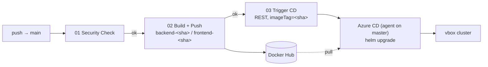

# MERN App — CI/CD to a VirtualBox Kubernetes Cluster

This repo ships a MERN app (React + Express + MongoDB) to a self-hosted
Kubernetes cluster running in VirtualBox. **CI builds, CD deploys** — the two
halves live in different systems and hand off through a single image tag.

- **CI — GitHub Actions:** security check → build images → push to Docker Hub →
  trigger CD.
- **CD — Azure DevOps** (self-hosted agent on the cluster master): `helm upgrade`
  with the exact image tag CI just built. Runs only after CI succeeds.
- **App secrets** (`JWT_SECRET`, `MONGO_URI`) live in a Kubernetes Secret — never
  in git or the pipeline.



**Why two systems?** GitHub Actions is the easiest place to build and push public
images; the vbox cluster has no public endpoint, so a self-hosted Azure DevOps
agent *inside* the network does the deploy. GitHub never touches the cluster; the
agent never builds images.

---

## How to read this doc

| Section | When you use it |
|---|---|
| [1. Cluster topology](#1-cluster-topology) · [2. Prerequisites](#2-prerequisites) | Reference — read once |
| [3. One-time bring-up](#3-one-time-bring-up-in-order) | Setting the system up, top to bottom |
| [4. Everyday workflow](#4-everyday-workflow-the-loop) | Every change, after bring-up |
| [5. Operate](#5-operate-verify-rollback-troubleshoot) | Health checks, rollback, debugging |
| [6. Hardening roadmap](#6-hardening-roadmap) · [7. File map](#7-file-map) | Reference |

The bring-up in §3 is **ordered and gated** — each step assumes the previous one
passed. Do not automate CD (§3.5) before the manual deploy (§3.3) works.

---

## 1. Cluster topology

| Role | Host | IP |
|---|---|---|
| Master (+ Azure DevOps agent) | `sv-k8s-master` | 192.168.100.233 |
| Worker 1 | `sv-k8s-wk-1` | 192.168.100.231 |
| Worker 2 | `sv-k8s-wk-2` | 192.168.100.232 |

Conventions used throughout: namespace `mern-app`, Helm release `mern-app`,
ingress host `mern.local`, image repo `<DOCKERHUB_USERNAME>/web-app-mern`. The
ingress is exposed as a **NodePort** (bare-metal cluster, no cloud LB) — that port
is written as `<INGRESS_NODEPORT>` below (e.g. `32652`) and is reachable on **any**
node IP.

---

## 2. Prerequisites

- [ ] kubeadm cluster up; `kubectl get nodes` shows all 3 `Ready`.
- [ ] `helm` v3 and `kubectl` on the master.
- [ ] Your own GitHub repo for this code (Actions run there, not in Azure DevOps).
- [ ] `DOCKERHUB_USERNAME` + `DOCKERHUB_TOKEN` in GitHub Actions secrets.
- [ ] Azure DevOps org + project (free tier is fine).
- [ ] A public Docker Hub repo `web-app-mern` (or make it private + add an
      `imagePullSecret`, see [Troubleshooting](#troubleshooting)).

---

## 3. One-time bring-up (in order)

### 3.1 Prepare the cluster

Run on the **master** (`192.168.100.233`).

**Ingress controller** (bare-metal → NodePort):
```bash
kubectl apply -f https://raw.githubusercontent.com/kubernetes/ingress-nginx/controller-v1.11.3/deploy/static/provider/baremetal/deploy.yaml
kubectl -n ingress-nginx get svc ingress-nginx-controller
# note the http NodePort, e.g. 80:3XXXX/TCP  → this is your <INGRESS_NODEPORT>
```

**Namespace + app Secret** (holds `JWT_SECRET` and `MONGO_URI`):
```bash
kubectl create namespace mern-app
kubectl create secret generic mern-app-secrets -n mern-app \
  --from-literal=JWT_SECRET="$(openssl rand -hex 24)" \
  --from-literal=MONGO_URI='mongodb://mern-app-mongodb:27017/mern-app'
```

**Hosts entry** on your **Windows host** (`C:\Windows\System32\drivers\etc\hosts`,
as admin) so the browser resolves the app to a node:
```
192.168.100.231  mern.local
```
The app URL is then `http://mern.local:<INGRESS_NODEPORT>`.

> The master itself has **no** such entry — that's expected. When you `curl` the
> health endpoint from the master, use the Host-header form in §5.1, not the
> `mern.local` name.

### 3.2 First CI build (get images onto Docker Hub)

You push to **two** remotes for two reasons — GitHub runs CI, Azure Repos is what
CD deploys the chart from. One commit, two pushes:

```powershell
git remote add github https://github.com/thientr18/MERN-simple-app.git   # once

git add -A && git commit -m "describe what changed"
git push origin side-branch           # Azure Repos — CD reads the chart here
git push github side-branch:main      # your GitHub → triggers CI on main
```

Then confirm CI is green: GitHub repo → **Actions** → `Security Check` →
`Build and Push Images`. The tags should appear on Docker Hub:
```
<DOCKERHUB_USERNAME>/web-app-mern:backend-<sha>
<DOCKERHUB_USERNAME>/web-app-mern:frontend-<sha>   (+ *-latest)
```
Note the `<sha>` (the pushed commit) — that's the tag you deploy next.

### 3.3 Manual Helm deploy — prove it by hand ⛔ (gate)

Before automating anything, deploy once by hand using the **same values file the
pipeline uses**, just rendered locally. Run on the master (clone the repo there
once):

```bash
git clone https://github.com/thientr18/MERN-simple-app.git && cd MERN-simple-app

# render the tokenized values (exactly what the CD pipeline does)
sed -e "s|__crServer__|<DOCKERHUB_USERNAME>|g" \
    -e "s|__IMAGE_TAG__|<sha>|g" \
    -e "s|__ingressHost__|mern.local|g" \
    k8s-helm/mern-app/values.tokenized.yaml > /tmp/values.yaml

helm upgrade --install mern-app k8s-helm/mern-app \
  -n mern-app -f /tmp/values.yaml --wait --timeout 5m
```

Verify (see §5.1 for the health check), then open
`http://mern.local:<INGRESS_NODEPORT>` from your Windows host → register → login →
dashboard. That confirms the whole path: **frontend → ingress → backend → MongoDB.**

> **Gate:** do not wire up CD (§3.4–3.5) until this manual deploy works.

### 3.4 Install the Azure DevOps self-hosted agent

The agent runs the CD pipeline on your network. It is **deploy-only**, so it needs
`helm` + `kubectl` + a kubeconfig — no Docker.

**In Azure DevOps:** Project settings → Agent pools → **Add pool** → Self-hosted →
name **`vbox-k8s`**. Create a PAT (User settings → PAT → scope **Agent Pools
(Read & manage)**).

**On the master** (`192.168.100.233`):
```bash
# helm (kubectl already present from kubeadm)
curl -fsSL https://raw.githubusercontent.com/helm/helm/main/scripts/get-helm-3 | bash

# kubeconfig for the agent user (must work WITHOUT sudo)
mkdir -p ~/.kube && sudo cp /etc/kubernetes/admin.conf ~/.kube/config
sudo chown "$USER" ~/.kube/config
kubectl get nodes && helm version

# agent (grab the current download URL from the pool's "New agent → Linux" page)
mkdir ~/azagent && cd ~/azagent
curl -LO https://download.agent.dev.azure.com/agent/4.255.0/vsts-agent-linux-x64-4.255.0.tar.gz
tar zxvf vsts-agent-linux-x64-*.tar.gz
./config.sh   # Server: https://dev.azure.com/<org> · PAT · pool: vbox-k8s
sudo ./svc.sh install && sudo ./svc.sh start
```
Verify: Agent pools → `vbox-k8s` shows the agent **Online**.

### 3.5 Create the CD pipeline + variable group

**Variable group** (Pipelines → Library → **+ Variable group** → **`mern-app-dev`**)
— non-secret config only:

| Variable | Value |
|---|---|
| `CR_SERVER` | `<DOCKERHUB_USERNAME>` |
| `INGRESS_HOST` | `mern.local` |

**Pipeline** (Pipelines → New pipeline → **Azure Repos Git** → your
`MERN-simple-app` repo → branch **`side-branch`** → *Existing YAML* →
`azure-pipelines/pipelines.deployment.mern-app.yaml`).

> The CD pipeline reads the chart from **Azure Repos, branch `side-branch`** —
> that's your source of truth in ADO. GitHub stays CI-only (`main`). The agent
> checks out Azure Repos with its built-in token, so no GitHub service connection
> is needed on the CD side. Keep both remotes in sync (one commit, two pushes).

The pipeline has `trigger: none`, so it won't auto-run. Do **one** manual run
(Run pipeline → branch `side-branch`, `imageTag=latest`) to register it and
approve the pool / variable-group permission prompts. Then grab the **pipeline id**
from its URL (`...?definitionId=NN`) — that `NN` is your `AZDO_PIPELINE_ID` below.

### 3.6 Wire the CI → CD handoff

GitHub repo → **Settings → Secrets and variables → Actions**:

| Name | Kind | Value |
|---|---|---|
| `AZDO_PAT` | secret | Azure DevOps PAT, scope **Build (Read & execute)** |
| `AZDO_ORG_URL` | variable | `https://dev.azure.com/<org>` |
| `AZDO_PROJECT` | variable | your project name |
| `AZDO_PIPELINE_ID` | variable | `NN` from §3.5 |
| `AZDO_PIPELINE_BRANCH` | variable | `refs/heads/side-branch` — the ADO repo branch CD reads (NOT GitHub's `main`) |

Now workflow `03-trigger-azure-cd` can queue the CD pipeline with the built
`<sha>`, checking out the chart from `side-branch`. **Bring-up is complete.**

---

## 4. Everyday workflow (the loop)

Once §3 is done, every change is just: **commit once → push to both remotes.**

```powershell
git add -A && git commit -m "describe what changed"
git push origin side-branch           # Azure Repos (chart source for CD)
git push github side-branch:main      # GitHub → starts CI → CD
```

What then happens automatically:
1. **GitHub Actions:** `Security Check` → `Build and Push Images` (`backend-<sha>`,
   `frontend-<sha>`) → `Trigger Azure CD` (REST call, passes `imageTag=<sha>`).
2. **Azure DevOps:** the CD pipeline runs on the `vbox-k8s` agent and
   `helm upgrade`s to the exact `<sha>` image.
3. **You verify** (§5.1).

That's the whole loop: **push → CI builds → CD deploys the exact image.** Keeping
the two remotes on the same commit is what guarantees the chart on Azure and the
image built from GitHub describe the same code

---

## 5. Operate — verify, rollback, troubleshoot

### 5.1 Health check

Confirm pods and image tag, then hit the health endpoint ([app.js](app.js) →
`GET /api/v1/health`):

```bash
kubectl get pods -n mern-app -o wide     # backend, frontend, mongodb → Running 1/1
helm history mern-app -n mern-app        # latest revision = deployed

# From the MASTER (which has no mern.local hosts entry): send the Host header
# the ingress routes on, and target any node IP directly.
curl -H 'Host: mern.local' http://192.168.100.231:<INGRESS_NODEPORT>/api/v1/health
# → {"status":"UP","message":"Server is healthy"}
```

> **From your Windows host** (which *does* have the hosts entry from §3.1) just use
> the name directly: `curl http://mern.local:<INGRESS_NODEPORT>/api/v1/health`, or
> open it in the browser.

Why the Host header? The ingress routes by hostname. If you `curl mern.local` on a
machine with no hosts entry you get `curl: (6) Could not resolve host: mern.local`
— that's a DNS failure on *your* side, **not** an unhealthy app. `-H 'Host: ...'`
lets you target the node IP while still presenting the hostname ingress expects.

### 5.2 Rollback

```bash
helm history mern-app -n mern-app                     # pick the last good REVISION
helm rollback mern-app <REVISION> -n mern-app --wait
```
Or re-run the CD pipeline manually with `imageTag=<older-sha>` (that image is still
on Docker Hub). Note: rolling back to the revision that is already `deployed` is a
no-op that just creates an identical new revision.

### 5.3 Troubleshooting

| Symptom | Fix |
|---|---|
| `curl: (6) Could not resolve host: mern.local` on the master | Expected — the master has no hosts entry. Use `curl -H 'Host: mern.local' http://192.168.100.231:<INGRESS_NODEPORT>/api/v1/health` (§5.1). **Not** an app failure. |
| CI job "waiting" / never runs | GitHub default branch must be `main`; workflows trigger there |
| Build 02 fails on secrets | `DOCKERHUB_USERNAME` / `DOCKERHUB_TOKEN` missing or wrong |
| CD "waiting for agent" | agent offline (`sudo ./svc.sh status`) or pool name ≠ `vbox-k8s` |
| Pipeline: "Secret mern-app-secrets missing" | run §3.1 (create the Secret) before deploying |
| `ImagePullBackOff` | image tag not on Docker Hub, or private repo without an `imagePullSecret` (`kubectl create secret docker-registry regcred -n mern-app --docker-username=... --docker-password=...`, then set `backend.imagePullSecrets` / `frontend.imagePullSecrets`) |
| backend `CrashLoopBackOff` | `kubectl logs -n mern-app deploy/mern-app-backend` — usually a bad `MONGO_URI` |
| `http://mern.local:<port>` unreachable | wrong NodePort/IP, hosts entry missing, or ingress-nginx pods not Running |
| Unreplaced-tokens error in CD | a variable is missing from `mern-app-dev` |
| Mongo data lost after reschedule | `emptyDir` is ephemeral — use a PVC or external Mongo/Atlas |

Debug order: pipeline log → `kubectl get pods -n mern-app` →
`kubectl describe pod <pod> -n mern-app` → `kubectl logs <pod> -n mern-app`.

---

## 6. Hardening roadmap

- **Persistent Mongo:** replace the `emptyDir` in `values.tokenized.yaml` with a
  PersistentVolumeClaim, or point `MONGO_URI` at MongoDB Atlas.
- **TLS:** install cert-manager, set `ingress.tlsSecret` + `ingress.clusterIssuer`.
- **Clean host access:** install MetalLB with a pool in `192.168.100.0/24` so
  ingress-nginx gets a real LB IP and you can drop the `:<NodePort>`.
- **Prod environment:** a second variable group + pipeline stage with approvals.

---

## 7. File map

| File | Role |
|---|---|
| `.github/workflows/01-security_check.yml` | CI: audit + lint/build |
| `.github/workflows/02-build-push-docker.yml` | CI: build + push images |
| `.github/workflows/03-trigger-azure-cd.yml` | CI→CD handoff (REST call) |
| `azure-pipelines/pipelines.deployment.mern-app.yaml` | CD: deploy only, `trigger: none` |
| `k8s-helm/mern-app/values.tokenized.yaml` | CD values (tokens filled by pipeline) |
| `k8s-helm/mern-app/values.local.yaml` | optional single-node local testing |
| `k8s-helm/mern-app/` | chart: backend + frontend + mongodb + ingress |
