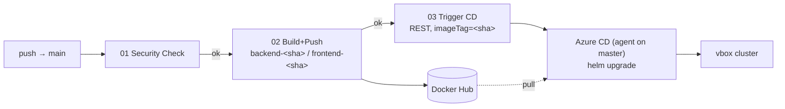

# Runbook — MERN App CI/CD on VirtualBox k8s

A start-to-finish guide to ship the MERN app to a VirtualBox Kubernetes cluster.

- **CI = GitHub Actions** — test, build, push images to Docker Hub.
- **CD = Azure DevOps** (self-hosted agent) — deploy with Helm. Runs only after CI
  succeeds, via a REST handoff that passes the image tag.
- **App secrets** live in a Kubernetes Secret, never in git or the pipeline.



---

## Your environment

| Role | Host | IP |
|---|---|---|
| Master (+ ADO agent) | `sv-k8s-master` | 192.168.100.233 |
| Worker 1 | `sv-k8s-wk-1` | 192.168.100.231 |
| Worker 2 | `sv-k8s-wk-2` | 192.168.100.232 |

Conventions used below: namespace `mern-app`, Helm release `mern-app`, ingress
host `mern.local`, image repo `<DOCKERHUB_USERNAME>/web-app-mern`.

---

## Prerequisites

- [ ] kubeadm cluster up; `kubectl get nodes` shows all 3 `Ready`.
- [ ] `helm` v3 and `kubectl` on the master.
- [ ] Your own GitHub repo for this code (Actions run there, not in Azure DevOps).
- [ ] `DOCKERHUB_USERNAME` + `DOCKERHUB_TOKEN` in GitHub Actions secrets. ✅ *(done)*
- [ ] Azure DevOps org + project (free tier is fine).
- [ ] A public Docker Hub repo `web-app-mern` (or make it private + add an
      `imagePullSecret`, see Troubleshooting).

---

## Step 1 — Push the repo to your GitHub (starts CI)

Two remotes, two jobs: **GitHub `main`** runs CI (Actions ignore Azure), **Azure
`side-branch`** is what the CD pipeline reads the chart from. Push to both.

```powershell
git remote add github https://github.com/thientr18/MERN-simple-app.git

git push origin side-branch           # Azure repo — CD reads the chart here
git push github side-branch:main      # your GitHub → triggers CI
```

Repeat both pushes for every change (one commit → two remotes) so the chart on
Azure and the images built from GitHub stay on the same commit. Details:
[git-push-workflow.md](git-push-workflow.md).

---

## Step 2 — Verify CI built the images

GitHub repo → **Actions**: `Security Check` → `Build and Push Images` should go
green. Then confirm the tags exist on Docker Hub:

```
<DOCKERHUB_USERNAME>/web-app-mern:backend-<sha>
<DOCKERHUB_USERNAME>/web-app-mern:frontend-<sha>   (+ *-latest)
```

Note the `<sha>` (the pushed commit) — you'll deploy that tag.

---

## Step 3 — Prepare the cluster (once)

Run on the **master** (`192.168.100.233`).

**3a. Ingress controller** (bare-metal → NodePort):
```bash
kubectl apply -f https://raw.githubusercontent.com/kubernetes/ingress-nginx/controller-v1.11.3/deploy/static/provider/baremetal/deploy.yaml
kubectl -n ingress-nginx get svc ingress-nginx-controller
# note the http NodePort, e.g. 80:3XXXX/TCP  → call it <INGRESS_NODEPORT>
```

**3b. Namespace + app Secret** (holds JWT_SECRET and MONGO_URI):
```bash
kubectl create namespace mern-app
kubectl create secret generic mern-app-secrets -n mern-app \
  --from-literal=JWT_SECRET="$(openssl rand -hex 24)" \
  --from-literal=MONGO_URI='mongodb://mern-app-mongodb:27017/mern-app'
```

**3c. Hosts entry** on your Windows host (`C:\Windows\System32\drivers\etc\hosts`,
as admin) so the browser resolves the app to a node:
```
192.168.100.231  mern.local
```
The app URL will be `http://mern.local:<INGRESS_NODEPORT>`.

---

## Step 4 — Manual Helm deploy (validate before automating)

Prove the chart, image, and routing work by hand — same values file the pipeline
uses, just rendered locally. Run on the master (clone the repo there once):

```bash
git clone https://github.com/thientr18/MERN-simple-app.git && cd MERN-simple-app

# render the tokenized values (this is exactly what the CD pipeline does)
sed -e "s|__crServer__|<DOCKERHUB_USERNAME>|g" \
    -e "s|__IMAGE_TAG__|<sha>|g" \
    -e "s|__ingressHost__|mern.local|g" \
    k8s-helm/mern-app/values.tokenized.yaml > /tmp/values.yaml

helm upgrade --install mern-app k8s-helm/mern-app \
  -n mern-app -f /tmp/values.yaml --wait --timeout 5m
```

Verify:
```bash
kubectl get pods -n mern-app          # backend, frontend, mongodb → Running 1/1
curl http://mern.local:<INGRESS_NODEPORT>/api/v1/health
# → {"status":"UP","message":"Server is healthy"}
```
Open `http://mern.local:<INGRESS_NODEPORT>` → register → login → dashboard.
That confirms frontend → ingress → backend → MongoDB.

> **Gate:** don't wire up CD until this works.

---

## Step 5 — Install the Azure DevOps self-hosted agent

The agent runs the CD pipeline on your network. Deploy-only, so it needs
**helm + kubectl + kubeconfig** — no Docker.

**5a. Azure DevOps:** Project settings → Agent pools → **Add pool** → Self-hosted
→ name **`vbox-k8s`**. Create a PAT (User settings → PAT → scope **Agent Pools
(Read & manage)**).

**5b. On the master** (`192.168.100.233`):
```bash
# helm (kubectl already present from kubeadm)
curl -fsSL https://raw.githubusercontent.com/helm/helm/main/scripts/get-helm-3 | bash

# kubeconfig for the agent user
mkdir -p ~/.kube && sudo cp /etc/kubernetes/admin.conf ~/.kube/config
sudo chown "$USER" ~/.kube/config
kubectl get nodes && helm version   # must work as this user, no sudo

# agent (grab the current URL from the pool's "New agent → Linux" page)
mkdir ~/azagent && cd ~/azagent
curl -LO https://download.agent.dev.azure.com/agent/4.255.0/vsts-agent-linux-x64-4.255.0.tar.gz
tar zxvf vsts-agent-linux-x64-*.tar.gz
./config.sh   # Server: https://dev.azure.com/<org> · PAT · pool: vbox-k8s
sudo ./svc.sh install && sudo ./svc.sh start
```
Verify: Agent pools → `vbox-k8s` shows the agent **Online**.

---

## Step 6 — Create the CD pipeline + variable group

**6a. Variable group** (Pipelines → Library → **+ Variable group** →
**`mern-app-dev`**) — non-secret config only:

| Variable | Value |
|---|---|
| `CR_SERVER` | `<DOCKERHUB_USERNAME>` |
| `INGRESS_HOST` | `mern.local` |

**6b. Pipeline** (Pipelines → New pipeline → **Azure Repos Git** → your
`MERN-simple-app` repo → branch **`side-branch`** → *Existing YAML* →
`azure-pipelines/pipelines.deployment.mern-app.yaml`).

> Connect to **Azure Repos on `side-branch`** — that's where you work in ADO and
> where the pipeline reads the chart from. GitHub stays CI-only (`main`). The
> agent checks out Azure Repos with its built-in token, so no GitHub service
> connection is needed on the CD side. Keep both remotes in sync (one commit,
> two pushes — see [git-push-workflow.md](git-push-workflow.md)).

It has `trigger: none`, so it won't auto-run. Do **one** manual run (Run
pipeline → branch `side-branch`, `imageTag=latest`) to register it and approve
the pool / variable-group permission prompts.

**6c. Pipeline id** — from the pipeline URL `...?definitionId=NN` → `NN` is your
`AZDO_PIPELINE_ID` for the next step.

---

## Step 7 — Wire the CI → CD handoff

GitHub repo → **Settings → Secrets and variables → Actions**:

| Name | Kind | Value |
|---|---|---|
| `AZDO_PAT` | secret | Azure DevOps PAT, scope **Build (Read & execute)** |
| `AZDO_ORG_URL` | variable | `https://dev.azure.com/<org>` |
| `AZDO_PROJECT` | variable | your project name |
| `AZDO_PIPELINE_ID` | variable | `NN` from Step 6c |
| `AZDO_PIPELINE_BRANCH` | variable | `refs/heads/side-branch` — the ADO repo branch the CD pipeline reads (NOT GitHub's `main`) |

Now workflow `03-trigger-azure-cd` can queue the CD pipeline with the built
`<sha>`, checking out the chart from `side-branch`.

---

## Step 8 — Full end-to-end run

```powershell
git commit --allow-empty -m "test: trigger cicd"
git push github side-branch:main
```

Watch it flow:
1. GitHub Actions: `Security Check` → `Build and Push Images` → `Trigger Azure CD`.
2. Azure DevOps: the CD pipeline runs on the agent, deploys `backend-<sha>`.
3. Verify:
```bash
kubectl get pods -n mern-app -o wide       # image tag = backend-<new-sha>
helm history mern-app -n mern-app
curl http://mern.local:<INGRESS_NODEPORT>/api/v1/health
```

That's the loop: **push → CI builds → CD deploys the exact image.**

---

## Rollback

```bash
helm history mern-app -n mern-app                     # pick the last good REVISION
helm rollback mern-app <REVISION> -n mern-app --wait
```
Or re-run the CD pipeline manually with `imageTag=<older-sha>` (that image is
still on Docker Hub).

---

## Troubleshooting

| Symptom | Fix |
|---|---|
| CI job "waiting" / never runs | GitHub default branch must be `main`; workflows trigger there |
| Build 02 fails on secrets | `DOCKERHUB_USERNAME` / `DOCKERHUB_TOKEN` missing or wrong |
| CD "waiting for agent" | agent offline (`sudo ./svc.sh status`) or pool name ≠ `vbox-k8s` |
| Pipeline: "Secret mern-app-secrets missing" | run Step 3b (create the Secret) before deploying |
| `ImagePullBackOff` | image tag not on Docker Hub, or private repo without an `imagePullSecret` (`kubectl create secret docker-registry regcred -n mern-app --docker-username=... --docker-password=...`, then set `backend.imagePullSecrets` / `frontend.imagePullSecrets`) |
| backend `CrashLoopBackOff` | `kubectl logs -n mern-app deploy/mern-app-backend` — usually a bad `MONGO_URI` |
| `http://mern.local:<port>` unreachable | wrong NodePort/IP, hosts entry missing, or ingress-nginx pods not Running |
| Unreplaced-tokens error in CD | a variable is missing from `mern-app-dev` |
| Mongo data lost after reschedule | `emptyDir` is ephemeral — use a PVC or external Mongo/Atlas |

Debug order: pipeline log → `kubectl get pods -n mern-app` →
`kubectl describe pod <pod> -n mern-app` → `kubectl logs <pod> -n mern-app`.

---

## Next steps (hardening)

- **Persistent Mongo:** replace the `emptyDir` in `values.tokenized.yaml` with a
  PersistentVolumeClaim, or point `MONGO_URI` at MongoDB Atlas.
- **TLS:** install cert-manager, set `ingress.tlsSecret` + `ingress.clusterIssuer`.
- **Clean host access:** install MetalLB with a pool in `192.168.100.0/24` so
  ingress-nginx gets a real LB IP and you can drop the `:<NodePort>`.
- **Prod environment:** a second variable group + pipeline stage with approvals.

---

## File map

| File | Role |
|---|---|
| `.github/workflows/01-security_check.yml` | CI: audit + lint/build |
| `.github/workflows/02-build-push-docker.yml` | CI: build + push images |
| `.github/workflows/03-trigger-azure-cd.yml` | CI→CD handoff (REST call) |
| `azure-pipelines/pipelines.deployment.mern-app.yaml` | CD: deploy only, `trigger: none` |
| `k8s-helm/mern-app/values.tokenized.yaml` | CD values (tokens filled by pipeline) |
| `k8s-helm/mern-app/values.local.yaml` | optional single-node local testing |
| `k8s-helm/mern-app/` | chart: backend + frontend + mongodb + ingress |
